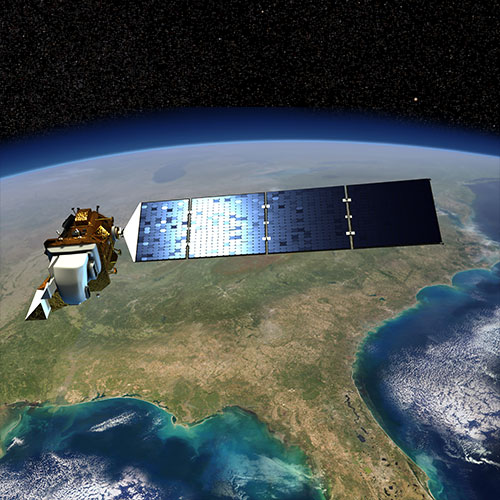
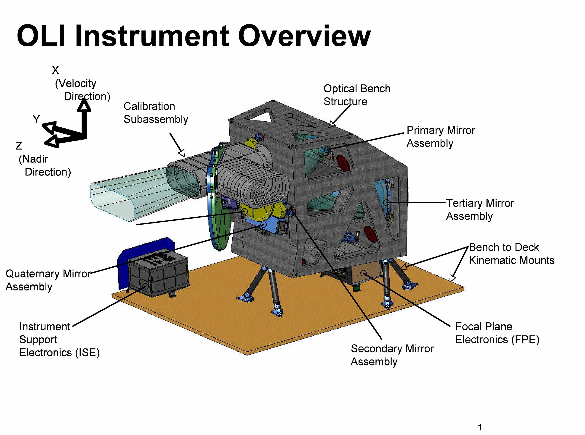
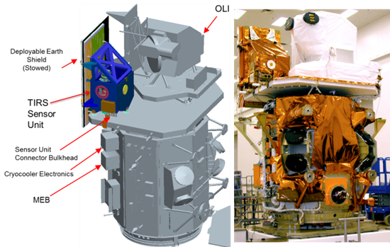
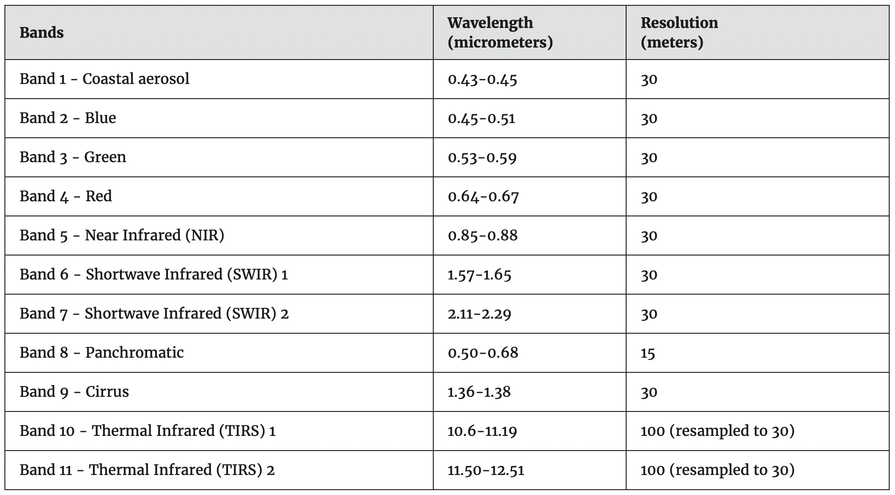
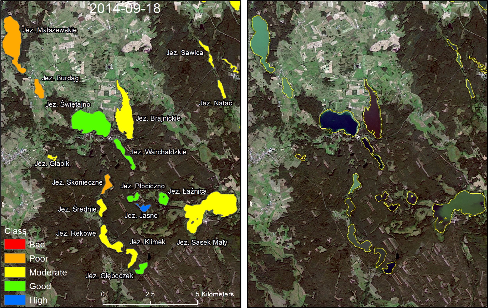
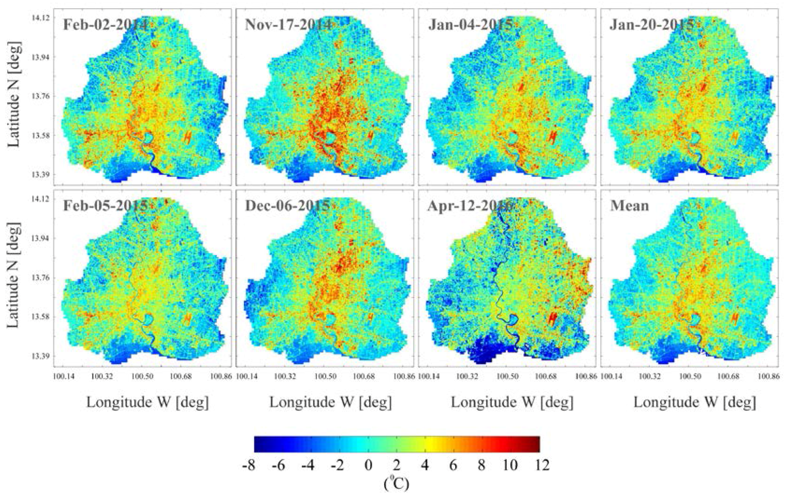
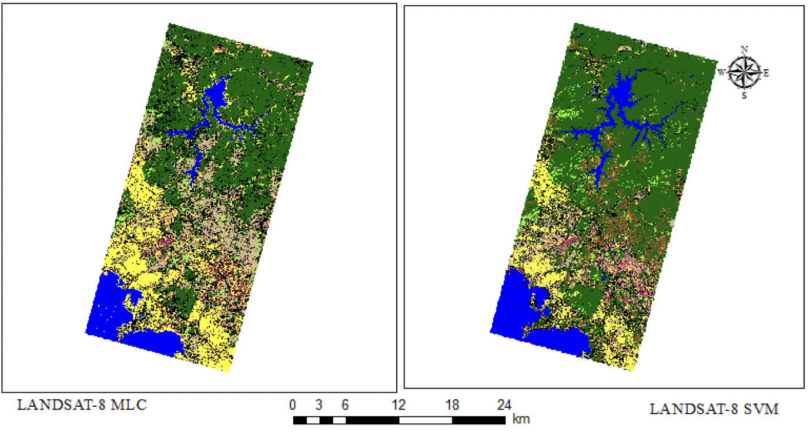

```{r xaringan-themer, include=FALSE, warning=FALSE}
library(xaringanthemer)
style_mono_accent(
  base_color = "#0A3B88",
  header_font_google = google_font("Josefin Sans"),
  text_font_google   = google_font("Montserrat", "300", "300i"),
  code_font_google   = google_font("Fira Mono"),
)
```

```{css, echo=FALSE}
/* Changing the font size of each slide */

/* the title font size for each slide */
.remark-slide-content h1 {
  font-size: 45px; 
}

.remark-slide-content h2 {
  font-size: 32px; 
}


.remark-slide-content h3 {
  font-size: 25px; 
}
```

```{r xaringan-all, echo=FALSE}
#xaringanExtra::use_scribble() #scribble drawing function, but too lag
xaringanExtra::use_search(show_icon = TRUE, auto_search	=FALSE) #search function
```

```{css, echo=FALSE}
/* Changing the font size of title slide */
.title-slide, .title-slide h1, .title-slide h2 {
  color: #0A3B88; 
}

.title-slide h3 {
  color: #176781;
}

.title-slide h1 {
  font-size: 52px; 
}

.title-slide h2 {
  font-size: 36px; 
}

.title-slide h3 {
  font-size: 24px; 
}
```

```{css, echo=FALSE}
/* background image*/
.title-slide {
  background-image: url(images/Week2_Landsat_8.jpeg);
}

/* adding an white zone */
.title-slide::before {
  content: "";
  position: absolute;
  top: 10%; 
  left: 0%;
  width: 100%;
  height: 80%; 
  background-color: rgba(255, 255, 255, 0.7); 
  z-index: 1;
}

/* icon background */
.title-slide::after {
  content: "";
  position: absolute;
  top: 10%; 
  left: 0;
  width: 100%; 
  height: 80%; 
  background-image: url(images/casalogo.png); 
  background-size: 135%; 
  background-position: center; 
  z-index: 0;
  opacity: 0.3;
}

/* text is above all */
.title-slide > * {
  position: relative;
  z-index: 2;
}
```


# Summary 1 - Landsat 8

<div style="position: absolute; top: 20px; right: 40px;">
  
</div>

.pull-left[
  
  
  <div style="font-size: 14px;"> 
  Landsat 8, Source: <a
  href="https://eospso.nasa.gov/missions/landsat-8"
  style="color: #AA18AA;">Originally from NASA's Earth Observing System</a>
  </div>
]

.pull-right[
* An American Earth observation satellite

* Launched on 11 February 2013

* Originally called the Landsat Data Continuity Mission (LDCM)

* Landsat program: The eighth satellite

* The seventh to reach orbit successfully


]


---
<div style="position: absolute; top: 20px; right: 40px;">
  
</div>

# Summary 2 - Three key mission

```{r xaringan-panelset, echo=FALSE}
xaringanExtra::use_panelset()
```

```{r echo=FALSE}
xaringanExtra::style_panelset_tabs(foreground = "white", background = "navy")
```


.panelset[
.panel[.panel-name[Mission 1]
## Data Collection and Archiving
* Medium resolution multispectral image data (30-meter spatial resolution)

* Affording seasonal coverage of the global landmasses

]


.panel[.panel-name[Mission 2]
## Consistency with earlier missions
* Acquisition Geometry

* Calibration

* Spectral characteristics

* Coverage characteristics

* Output product quality

* Data availability

* Permit studies change over time

]


.panel[.panel-name[Mission 3]
## Products Distribution (U.S. Geological Survey, 2012)
* Nondiscriminatory basis

* No cost to the user

]


]

---
<div style="position: absolute; top: 20px; right: 40px;">
  
</div>

# Summary 3 - Instruments

.pull-left[
### Operational Land Imager
  
  
  <div style="font-size: 14px;"> 
  OLI structure, Source: <a
  href="https://upload.wikimedia.org/wikipedia/commons/1/1c/Landsat_Data_Continuity_Mission_Operational_Land_Imager_Instrument_Design.jpg"
  style="color: #AA18AA;">Originally from NASA</a>
  </div>
]

.pull-right[
### Thermal Infrared Sensor
  
  
  <div style="font-size: 14px;"> 
  OLI & TIRS, (Reuter et al., 2015)
  </div>


]


---
<div style="position: absolute; top: 20px; right: 40px;">
  
</div>

# Summary 4 - Bands

<br>



<div style="font-size: 14px;"> 
Landsat 8 Bands, Source: <a
href="https://www.usgs.gov/faqs/what-are-band-designations-landsat-satellites"
style="color: #AA18AA;">Originally from USGS</a>
</div>


---
<div style="position: absolute; top: 20px; right: 40px;">
  
</div>

# Applications 1 - Lake Water Quality

.pull-left[
  
  
  <div style="font-size: 14px;"> 
  Assigning ecological classes for small part of image area (Urbanski et al., 2016)
  </div>
]

.pull-right[
* Urbanski's (2016) study utilised Landsat 8 imagery to assess the quality of regional lakes.

* There is a strong correlation between the band combinations of the OLI and the trophic state of the lakes.

* They developed a tool that can rapidly classify 2,800 lakes.

]


---
<div style="position: absolute; top: 20px; right: 40px;">
  
</div>

# Applications 2 - Urban Heat Island

.pull-left[
  
  
  <div style="font-size: 14px;"> 
  SUHI maps of Bangkok urban area obtained by the seven Landsat 8 clear-sky images (Keeratikasikorn & Bonafoni, 2018)
  </div>
]

.pull-right[
* Keeratikasikorn & Bonafoni's study (2018) made use of reflectance and thermal data from Landsat 8 imagery spanning 2014 to 2016.

* It examined the identification of Surface Urban Heat Island (SUHI) patterns across various land use categories in Bangkok.

* This was aimed at determining whether strategies need to be implemented to mitigate the urban heat island effect.

]


---
<div style="position: absolute; top: 20px; right: 40px;">
  
</div>

# Applications 3 - Land Cover/Use

.pull-left[
  
  
  <div style="font-size: 14px;"> 
  Land Classification using MLC and SVM (Topaloğlu, Sertel & Musaoğlu, 2016)
  </div>
]

.pull-right[
* Topaloğlu, Sertel & Musaoğlu's research (2016) employed Landsat-8 data to generate land cover/use maps for the study area of the Istanbul metropolitan in Turkey.

* It compared the classification outcomes of two methods: Maximum Likelihood (MLC) and Support Vector Machine (SVM).

* The study identified the optimal method for creating current land cover/use maps for the region.

]


---
<div style="position: absolute; top: 20px; right: 40px;">
  
</div>

# Reflection

* Landsat 8's two instruments, OLI and TIRS, endow it with high-quality observational capabilities. Its applications are very broad, encompassing water body monitoring, mitigating urban heat island effects, land planning, and more.

* However, different satellites each have their advantages and disadvantages. Compared to Sentinel-2, Landsat possesses TIRS which can monitor surface temperature, making it more advantageous in applications aimed at mitigating urban heat island effects.

* Nonetheless, Landsat 8 has a longer revisit cycle, at 16 days (compared to Sentinel-2's 5 days).


---
<div style="position: absolute; top: 20px; right: 40px;">
  
</div>

# Reference

Keeratikasikorn, C., & Bonafoni, S. (2018). Urban heat island analysis over the land use zoning plan of Bangkok by means of Landsat 8 imagery. Remote Sensing, 10(3), 440.

Reuter, D. C., Richardson, C. M., Pellerano, F. A., Irons, J. R., Allen, R. G., Anderson, M., ... & Thome, K. J. (2015). The Thermal Infrared Sensor (TIRS) on Landsat 8: Design overview and pre-launch characterization. Remote Sensing, 7(1), 1135-1153.

Topaloğlu, R. H., Sertel, E., & Musaoğlu, N. (2016). Assessment of classification accuracies of Sentinel-2 and Landsat-8 data for land cover/use mapping. The International archives of the photogrammetry, remote sensing and spatial information sciences, 41, 1055-1059.

Urbanski, J. A., Wochna, A., Bubak, I., Grzybowski, W., Lukawska-Matuszewska, K., Łącka, M., ... & Zajączkowski, M. (2016). Application of Landsat 8 imagery to regional-scale assessment of lake water quality. International Journal of Applied Earth Observation and Geoinformation, 51, 28-36.

U.S. Geological Survey (July 2012). "Landsat Data Continuity Mission". Rolla Publishing Service Center. Retrieved 12 February 2013.


---

class: inverse, center, middle

# Thanks!